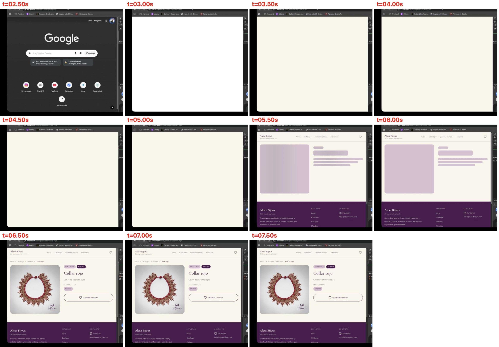
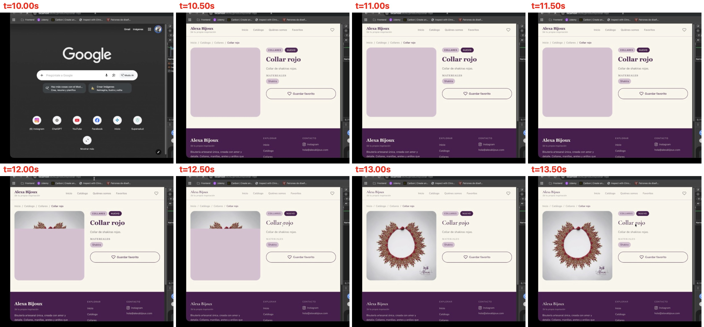
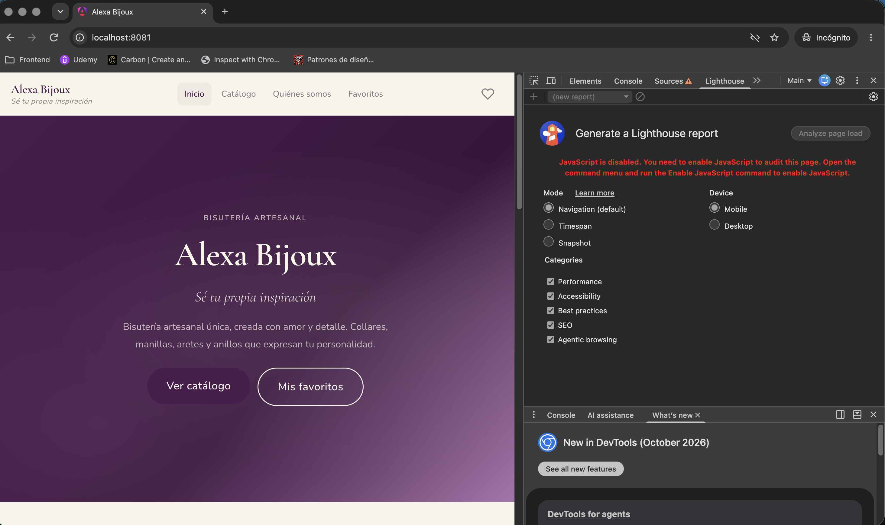
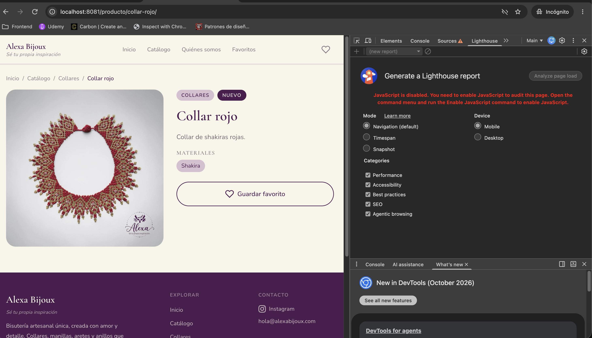

# Evaluación de técnicas de renderizado: CSR vs pre-render (SSG)

## 1. Objetivo

Comparar el rendimiento y la experiencia de usuario de **Alexa Bijoux** con dos técnicas de renderizado:

- **CSR** (fase 2, tag `fase-2`): el navegador recibe un `index.html` vacío y Angular construye la página.
- **Pre-render / SSG** (fase 3, rama `fase-3-ssg`): el HTML de cada página se genera en el build con los datos de Contentful.

## 2. Implementación del pre-render

| Archivo | Cambio | Motivo |
|---|---|---|
| `angular.json` | Opciones `server: src/main.server.ts` y `prerender` con `routesFile`, **sin** la opción `ssr` | Angular se ejecuta en Node solo durante el build; no hay servidor en producción |
| `src/main.server.ts`, `src/app/app.config.server.ts` | Nuevos | Punto de entrada de Angular en Node (`provideServerRendering`) |
| `scripts/generate-prerender-routes.mjs` + script `prebuild` | Nuevos | Angular no puede adivinar los slugs de `/producto/:slug`; el script los pide a Contentful y genera `prerender-routes.txt` antes de cada build |
| `src/app/app.config.ts` | Vuelve `provideClientHydration()` | Angular reutiliza el HTML pre-renderizado en lugar de reconstruirlo |
| `FavoritesComponent` | La lista se muestra solo después de `afterNextRender` | Ver sección 6.2 |

Resultado: **11 rutas pre-renderizadas** (inicio, catálogo, 4 categorías, Quiénes somos, favoritos y una página por producto). Se agregan automáticamente las páginas de los productos nuevos en cada build.

Gracias a `provideClientHydration()` y al caché de transferencia de `HttpClient`, los datos de Contentful viajan dentro del HTML (TransferState): **ninguna página vuelve a llamar a Contentful en el navegador** (0 peticiones, verificado en las pestañas de red).

## 3. Metodología

| Medición | Herramienta | Condiciones |
|---|---|---|
| Rendimiento (manual) | Lighthouse en Chrome DevTools | Build de producción con `http-server` (sin compresión), móvil, incógnito, página de inicio |
| Rendimiento (controlado) | Lighthouse CLI | Mismas condiciones para ambas versiones, **con compresión gzip** (como en Vercel), 3 corridas por página, mediana |
| Experiencia de usuario | Grabación de pantalla | Chrome con "Slow 4G" y caché deshabilitada, página `/producto/collar-rojo` |
| Lo que ven los bots | Chrome con JavaScript deshabilitado | Inicio y página de producto |

## 4. Resultados de rendimiento

### 4.1 Medición manual (sin compresión)

| Métrica | CSR | SSG |
|---|---|---|
| Performance | 85 | 83 |
| FCP | 3.0 s | 3.2 s |
| LCP | 3.5 s | 3.6 s |
| TBT | 0 ms | 0 ms |
| CLS | 0.002 | 0.002 |
| Speed Index | 3.0 s | 3.2 s |

Los resultados salieron prácticamente iguales. Al analizarlo se encontró un sesgo en la medición: `http-server` **no comprime** los archivos. El HTML pre-renderizado pesaba 59.6 KB contra 18.8 KB en CSR, y los ~300 KB de JavaScript viajaban sin comprimir en ambas versiones. En la red 4G que simula Lighthouse, eso ocultaba la diferencia.

### 4.2 Medición controlada (con compresión gzip, mediana de 3 corridas)

| Página | Métrica | CSR | SSG | Diferencia |
|---|---|---|---|---|
| Inicio | Performance | 98 | 99 | +1 |
| | FCP | 1.75 s | 1.51 s | −14 % |
| | LCP | 2.14 s | 1.66 s | −22 % |
| | HTML transferido | 2.5 KB | 10.0 KB | |
| Producto | Performance | 87 | 90 | +3 |
| | FCP | 1.75 s | 1.51 s | −14 % |
| | LCP | 3.93 s | 3.57 s | −9 % |
| | CLS | 0.016 | 0.000 | Sin saltos de diseño |
| Ambas | TBT | 0 ms | 0 ms | = |

### 4.3 Interpretación

- **SSG mejora todas las métricas, pero la diferencia es moderada.** La aplicación es pequeña: el JavaScript es liviano (TBT = 0) y solo hay 3 productos, así que a CSR no le cuesta mucho arrancar. En aplicaciones con más JavaScript, dispositivos de gama baja o más llamadas a APIs, la brecha crece.
- **SSG saca la llamada a Contentful del camino crítico.** En CSR la página de producto espera el JavaScript, luego la API y luego la imagen. En SSG los datos ya vienen en el HTML. Con la latencia real de Contentful, la diferencia sería mayor que en la simulación.
- **La compresión importó más que la técnica.** Con gzip, CSR pasó de 84 a 98 en Performance. Medir sin compresión lleva a conclusiones equivocadas.
- **El LCP de la página de producto (3.5 s) lo define la foto** (~170 KB a tamaño completo), igual en ambas técnicas. Es una mejora independiente del renderizado (sección 8).

## 5. Experiencia de usuario

### 5.1 Carga de la página de producto con "Slow 4G"

**CSR** (tiempos aproximados desde la navegación):

- **0 – 2.5 s:** pantalla en blanco.
- **~2.75 s:** aparecen header, footer y *skeletons*: Angular ya se ejecutó, pero espera la respuesta de Contentful.
- **~3.75 s:** producto completo con foto.

**SSG:**

- **~0.5 s:** título, descripción, materiales y botón visibles; solo falta la foto.
- **~2 s:** la foto empieza a cargar.
- **~2.75 s:** página completa.

**Conclusión:** en CSR el usuario mira una pantalla vacía durante ~2.5 s sin saber si la página funciona. En SSG ve la información del producto casi de inmediato y solo espera la foto. La percepción de velocidad mejora más de lo que sugieren los números de Lighthouse.

**Observación:** en SSG el título aparece primero con una fuente de respaldo y luego cambia a la fuente de la marca (*font swap*, por `font-display: swap` de Google Fonts). En CSR no se nota porque la fuente ya cargó cuando Angular pinta. No genera saltos de diseño (CLS = 0).

### 5.2 Lo que ven los bots (JavaScript deshabilitado)

| CSR | SSG: inicio | SSG: producto |
|---|---|---|
|  |  |  |
| Página en blanco | Página completa | Producto completo con foto |

Además, en CSR `/producto/collar-rojo` solo funciona gracias al *rewrite* a `index.html`; en SSG existe un archivo HTML real para esa ruta.

## 6. SEO y hallazgos técnicos

### 6.1 Lighthouse no mide bien el SEO de CSR

Lighthouse da SEO = 100 a ambas versiones porque ejecuta el JavaScript antes de auditar. La diferencia real está en el HTML inicial, que es lo que leen los bots que no ejecutan JavaScript (vistas previas de WhatsApp, Instagram y Facebook) y lo que Google indexa en su primera pasada:

| En el HTML inicial de `/producto/collar-rojo` | CSR | SSG |
|---|---|---|
| `<title>` del producto | ❌ Título genérico del sitio | ✅ "Collar rojo \| Alexa Bijoux" |
| `meta description` | ❌ Genérica | ✅ Descripción del producto |
| `og:image` (vista previa al compartir) | ❌ Imagen genérica | ✅ Foto del producto |
| `canonical` | ❌ Genérico | ✅ URL del producto |
| JSON-LD `Product` | ❌ | ✅ |
| Contenido (`<h1>`, descripción) | ❌ `<app-root>` vacío | ✅ |

### 6.2 Rutas no pre-renderizadas y el "cascarón" de favoritos

Al pre-renderizar, el `index.html` de la raíz pasa a ser **la página de inicio**. Una ruta sin HTML propio recibe, por el *rewrite*, el HTML del inicio: el usuario lo ve por un instante antes de que Angular muestre la página correcta.

`/favoritos` depende del `localStorage` de cada usuario, así que no puede pre-renderizarse con datos. La solución fue pre-renderizarla como **cascarón** (header, footer y *skeletons*) y mostrar la lista con `afterNextRender`, que solo corre en el navegador después de la hidratación. Así el HTML del servidor y el primer render del navegador son idénticos y se evita un *hydration mismatch*.

## 7. Comparación final

| Criterio | CSR | SSG | Ganador para Alexa Bijoux |
|---|---|---|---|
| Tiempo hasta ver contenido | ~2.5 s en blanco | ~0.5 s | SSG |
| Métricas Lighthouse (gzip) | 98 / 87 | 99 / 90 | SSG (moderado) |
| SEO y vistas previas | Página vacía para bots | HTML completo por producto | **SSG** (objetivo principal del negocio) |
| Peticiones a Contentful por visita | 1 o más | 0 | SSG |
| Contenido actualizado | Inmediato | Hasta el siguiente build | CSR |
| Tiempo de build | ~3 s | ~5–10 s + consulta a Contentful | CSR |
| Complejidad | Baja | Media: código compatible con Node, script de rutas, cascarón de favoritos | CSR |
| Costo de hosting (Vercel gratis) | Estático | Estático | Empate |

**Decisión:** para Alexa Bijoux se elige **SSG**. El objetivo principal es que los productos se encuentren en Google y se vean bien al compartirlos, y el contenido es igual para todos y cambia poco. Su desventaja (contenido desactualizado hasta el siguiente build) se resuelve con un rebuild automático al publicar (sección 8.1).

**¿Cuándo cambiaría la decisión?**

- Precios o stock que cambian constantemente → SSR en las páginas de producto.
- Un área privada (cuenta, pedidos) → CSR en esas rutas.
- Miles de productos → evaluar SSR con caché o pre-render solo de los productos más visitados.

## 8. Pendientes y mejoras

### 8.1 Rebuild automático al publicar (webhook)

Se configurará al desplegar en Vercel:

1. **Vercel:** *Settings → Git → Deploy Hooks* → crear un hook para la rama `main` y copiar la URL.
2. **Contentful:** *Settings → Webhooks → Add webhook* → pegar la URL del hook, método `POST`, y activarlo en los eventos *Publish* y *Unpublish* de entradas y assets.
3. Cuando se publique un producto, Contentful llama al hook, Vercel ejecuta `npm run build` (el `prebuild` incluye el producto nuevo) y el sitio se actualiza en 1–2 minutos.

### 8.2 Otras mejoras

- **Imágenes:** pedir a Contentful un tamaño adecuado (parámetro `w`) para bajar el LCP de la página de producto, y no dar prioridad de carga a las imágenes del inicio que están debajo del hero.
- **Imagen para redes:** `/assets/images/og-cover.jpg` está referenciada pero no existe.
- **Sitemap:** generar `sitemap.xml` con los productos en el mismo script de rutas.
- **Feedback de usuarios:** validar la percepción de velocidad con usuarios reales una vez desplegado el sitio.
