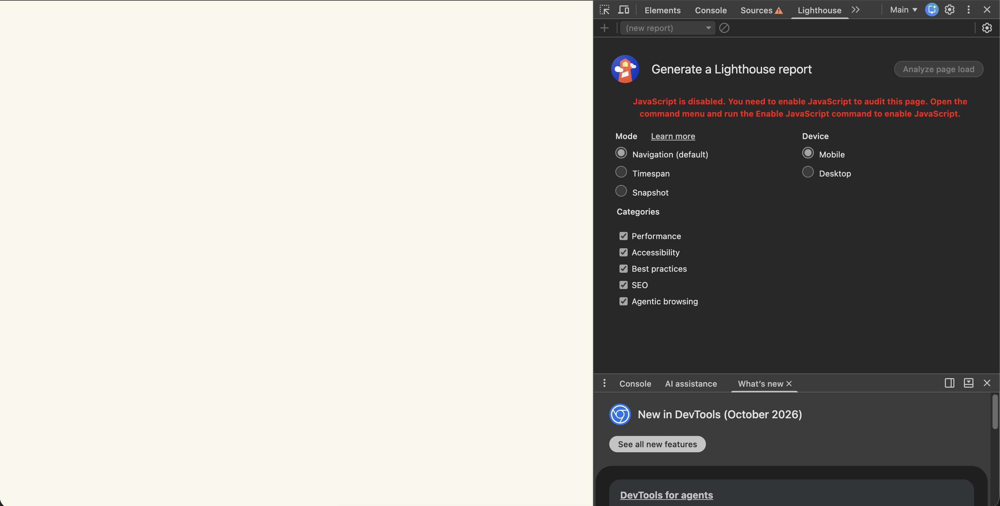

# Implementación de una técnica de renderizado: CSR

## 1. Técnica elegida y por qué

Para la fase 2 se configuró **Alexa Bijoux** (catálogo de bisutería con Angular 17 y Contentful) en modo **CSR (Client-Side Rendering)**.

CSR no es la técnica final del proyecto (ver `comparacion-renderizado.md`, sección 6): el objetivo del negocio es el SEO, y para eso la técnica elegida es el pre-render (fase 3). CSR se implementa como **línea base**: es el modo por defecto de Angular y permite medir y evidenciar el problema que el pre-render debe resolver.

## 2. Punto de partida

La aplicación venía configurada con SSR + pre-render (`@angular/ssr`, servidor Express y despliegue en una función serverless de Vercel). El build generaba 4 páginas HTML completas (entre 41 y 51 KB), con los productos incluidos en el HTML.

## 3. Cambios realizados

| Archivo | Cambio | Motivo |
|---|---|---|
| `angular.json` | Se eliminaron las opciones `server`, `prerender` y `ssr` del builder `application` | Sin ellas, Angular solo genera los archivos del navegador: no hay servidor ni HTML pre-renderizado |
| `server.ts`, `src/main.server.ts`, `src/app/app.config.server.ts` | Eliminados | Eran el servidor Express y el punto de entrada de Angular en el servidor |
| `src/app/app.config.ts` | Se quitó `provideClientHydration()` | La hidratación reutiliza HTML generado en el servidor; en CSR Angular construye todo el DOM desde cero |
| `package.json` | Se quitaron `@angular/ssr`, `@angular/platform-server`, `express`, `@types/express` y el script `serve:ssr` | Dependencias exclusivas del servidor |
| `tsconfig.app.json` | Solo compila `src/main.ts` | Los archivos del servidor ya no existen |
| `vercel.json` | Pasa de enviar todo a la función SSR a servir la carpeta `dist/alexa-bijoux/browser` como sitio estático, con un *rewrite* a `index.html` | Ver sección 5.1 |

Se mantuvo a propósito `isPlatformBrowser` en `FavoritesService`: en CSR no es necesario, pero se necesitará en la fase 3, cuando el pre-render ejecute el código en Node.

### Resultado del build

| | Antes (SSR + pre-render) | Después (CSR) |
|---|---|---|
| HTML generados | 4 (uno por ruta) | 1 (`index.html`) |
| Contenido de `<app-root>` | Página completa con productos | `<app-root></app-root>` vacío |
| Tamaño del `index.html` | ~51 KB | ~19 KB (principalmente CSS crítico incrustado) |
| Tiempo de build | ~10 s | ~3 s |

## 4. Medición de la línea base

**Condiciones:** build de producción (`npm run build`) servido con `http-server`, Lighthouse en Chrome (modo Navigation, dispositivo Mobile, ventana de incógnito), página de inicio.

| Métrica | Resultado |
|---|---|
| Performance | 85 |
| Accessibility | 96 |
| Best Practices | 100 |
| SEO | 100 |
| First Contentful Paint (FCP) | 3.0 s |
| Largest Contentful Paint (LCP) | 3.5 s |
| Total Blocking Time (TBT) | 0 ms |
| Cumulative Layout Shift (CLS) | 0.002 |
| Speed Index | 3.0 s |

### Interpretación

- **FCP ≈ Speed Index ≈ 3 s:** durante 3 segundos el usuario no ve nada. El navegador debe descargar y ejecutar el JavaScript de Angular antes de pintar el primer contenido. Es el comportamiento característico de CSR.
- **TBT 0 ms y CLS 0.002:** la aplicación es liviana y los *skeletons* de carga reservan el espacio de los productos, evitando saltos de diseño.
- **El SEO 100 es engañoso:** Lighthouse ejecuta el JavaScript antes de auditar, así que evalúa la página ya renderizada. Los bots que no ejecutan JavaScript (vistas previas de WhatsApp, Instagram o Facebook) o que lo hacen en una segunda pasada (Google) reciben el `index.html` vacío.

### Evidencia: página con JavaScript deshabilitado

Con JavaScript deshabilitado en DevTools, la página se ve completamente en blanco: es lo que recibe un bot que no ejecuta JavaScript.

## 5. Problemas encontrados

### 5.1 Error 404 al abrir una ruta directamente

En CSR solo existe `index.html`. Al abrir directamente `/catalogo` o `/producto/collar-rojo` (por ejemplo, desde un enlace compartido o al recargar la página), el servidor busca un archivo con esa ruta, no lo encuentra y responde 404: el router de Angular nunca llega a ejecutarse. Navegando dentro de la aplicación no ocurre, porque el router cambia la URL sin pedirle nada al servidor.

Se verificó sirviendo el build sin configuración adicional: `/` respondía 200, pero `/catalogo` y `/producto/collar-rojo` respondían 404.

**Solución:** un *rewrite* en `vercel.json` que responde `index.html` para cualquier ruta que no sea un archivo real.

### 5.2 Productos que no se mostraban

Con productos publicados en Contentful, la página no mostraba ninguno aunque la API respondía `200 OK`. Contentful no incluye las imágenes dentro de cada producto: envía una referencia (`id`) y los datos de la imagen por separado en `includes.Asset`. El código intentaba leer la imagen directamente desde la referencia, lo que lanzaba un error; un `catchError(() => of([]))` lo ocultaba devolviendo una lista vacía.

**Solución:** resolver las referencias de imágenes con `includes.Asset` en `ContentfulService`.

**Aprendizaje:** un `catchError` que no registra el error puede ocultar bugs reales; la página parecía "sin productos" en lugar de mostrar una falla.

### 5.3 Otros ajustes

- Se creó `src/assets/site.webmanifest`, referenciado en `index.html` pero inexistente (error 404 en consola; Best Practices pasó de 96 a 100).
- Se corrigió el contraste del botón "Mis favoritos" sobre el fondo oscuro del inicio.
- Pendiente: la imagen para redes sociales (`/assets/images/og-cover.jpg`) está referenciada pero no existe.

## 6. Conclusión

CSR es simple de configurar, rápido de compilar y barato de desplegar (archivos estáticos en un CDN). Pero para Alexa Bijoux tiene dos problemas: el usuario ve una pantalla en blanco durante ~3 s en móvil, y los bots que no ejecutan JavaScript reciben una página vacía, lo que perjudica el SEO y las vistas previas al compartir enlaces. Estos son los puntos que el pre-render debe mejorar en la fase 3.
